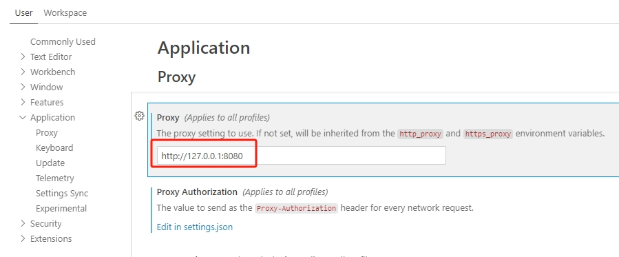
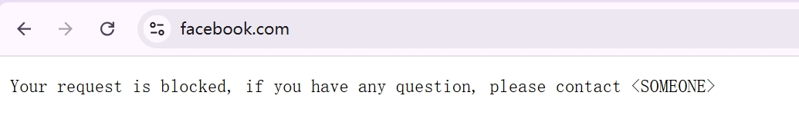

# internal-proxy-for-copilot

# Copilot Proxy Insight of Every User

> ⚠️**Disclaimer**: This project is open sourced to solve problems that are critical to some users, and the functions provided may not be natively provided by GitHub Copilot. Therefore the contents,  opinions and views expressed in this project are solely mine do not necessarly refect the views of my employer, These are my personal notes based on myunderstanding of the code and trial deployments to GitHub Copilot. If anything is wrong with this article, please let me know through the [issues](https://github.com/satomic/internal-proxy-for-copilot/issues/new). l appreciate your help in correcting my understanding.

> ✅**Risk Warning**: This project do not has any potential risks.


| **Version**​ | **Update Notes**​  | **Date**​ |
| ------------ | --------------------------------------------------------------------------------------- | --------- |
| 1.0          | init | 20250110  |
| 1.1          | Compatible with upstream mode, the situation that ip_address will be None, add IDE & extensions whitelist | 20250111  |

## Table of contents
- [Introduction](#introduction)
  - [Why Built This](#why-built-this)
- [Warning](#warning)
- [How to Use](#how-to-use)
  - [Admin: Server Side](#admin-server-side)
    - [Install Proxy `mitmproxy`](#install-proxy-mitmproxy)
    - [Configure `proxy_addons.py`](#configure-proxy_addonspy)
  - [Users: Client Side](#users-client-side)
    - [Configure Proxy in IDEs & Install Certs](#configure-proxy-in-ides--install-certs)
- [Log Samples](#log-samples)

---

# Introduction

## Why Built This
To [configuring your proxy server or firewall for Copilot](https://docs.github.com/en/copilot/managing-copilot/managing-github-copilot-in-your-organization/configuring-your-proxy-server-or-firewall-for-copilot). This is a script for the mitmdump tool, which is used to intercept and modify HTTP traffic. The script is designed to act as a proxy with specific rules and configurations. Here's a breakdown of its purpose:
- Proxy Switch: A boolean flag (`proxy_switch`) to enable or disable the proxy functionality.
- Forbidden Note: A message (`forbidden_note`) that will be sent to clients when their request is blocked.
- Allowed Domains: Lists of domains that are allowed to pass through the proxy without being blocked. These include:
    `your_allowed_domains`: Custom domains specified by the user.
    `github_copilot_official_domains`: Official GitHub Copilot domains.
    `github_public_domains`: Public GitHub domains.
    `msft_extra_id_domains`: Microsoft Extra ID domains.
    `msft_extra_id_ips`: Placeholder for additional IP addresses related to Microsoft services.
The script uses the mitmproxy library to handle HTTP requests and responses, and it includes logic to check if the requested URL is in the allowed domains list. If not, it blocks the request and sends the forbidden note to the client.


# Warning
- these are general guidelines for copilot block:
  1. **Do not change any GitHub Copilot http headers on network**
  2. Do not share GitHub accounts and GitHub Copilot access
     - GitHub personal account can not be shared, GitHub can block those shared accounts.
     - GitHub Copilot access can not be shared between multiple users.
  3. Maintain a single GitHub Copilot access network outbound so one user do not access GitHub Copilot from different locations at the same time
  4. do not use a program to generate copilot token, the token need to be requested from official GitHub Copilot IDE extension
- GitHub does not recommend customer on solution that is not part of GitHub product, in the case of internet proxy officially GitHub support will not support issues on proxy or advise which proxy to use.


# How to Use

## Admin: Server Side

### Install Proxy `mitmproxy`

1. Prepare an intermediary server, with IP address `a.b.c.d` (The following diagrams and documents all use `127.0.0.1` as an example. Please replace it with your actual IP address).
2. Follow the doc to [install mitmproxy](https://docs.mitmproxy.org/stable/overview-installation/ "install mitmproxy"). If you use pip to install mitmproxy on Windows, you need to add the exe path to the environment variable.

### Configure `proxy_addons.py`

1. There are some key parameters to configure in `proxy_addons.py`, mitmproxy will automatically reload the script once it has been modified.
    ```python
    # Forbidden Note, you can change the note to your own note
    forbidden_note = b"Your request is blocked, if you have any question, please contact <SOMEONE>"

    # Your allowed domains, you need to change the domain to your own domain, expecially change the `satomic` to your own organization name or enterprise name
    your_allowed_domains = [
        "https://github.com/satomic/*",
        "https://github.com/satomic?*",
        "https://github.com/enterprises/satomic/*",
    ]
    ```
2. run command in console
   ```bash
   # Option 1: regular mode https://docs.mitmproxy.org/stable/concepts-modes/#regular-proxy
   mitmdump --listen-host 0.0.0.0 --listen-port 8080 --set block_global=false -s proxy_addons.py --mode regular

   # Option 2: upstream mode https://docs.mitmproxy.org/stable/concepts-modes/#upstream-proxy
   mitmdump --listen-host 0.0.0.0 --listen-port 8080 --set block_global=false -s proxy_addons.py --mode upstream:http://UPSTREAM_PROXY_IP:UPSTREAM_PROXY_PORT
   ```
3. Tell the client to set the proxy in the IDE, and the IP address is `a.b.c.d` (The following diagrams and documents all use `127.0.0.1` as an example. Please replace it with your actual IP address).

## Users: Client Side

### Configure Proxy in IDEs & Install Certs

1. now you can set the proxy in your IDE (VSCode as example here, if you are using JetBrains, after set proxy, you need to restart the JetBrains IDE), and the IP address is `127.0.0.1` as an example, please change it to your actual IP address.
   - set the proxy like: `http://127.0.0.1:8080`
     
   - or in `settings.json`
     ```json
     "http.proxy": "http://127.0.0.1:8080"
     ```
2. However, at this time, IDE will prompt certificate errors, so a [certificate needs to be installed](https://docs.mitmproxy.org/stable/concepts-certificates/ "certificate needs to be installed"). The certificate download requires access to [mitm.it](mitm.it "mitm.it"), and the prerequisite for normal access is that mitmproxy is functioning normally. Therefore, before enabling the proxy, only requests that go through the proxy will return normal web pages.
3. Then everything is OK now, you can use GitHub Copilot as usual.🙂


# Log Samples
Server side log samples:
```
[14:49:10.294] ====================================================================================================
[14:49:10.295] 🔵 SRC IP: 127.0.0.1, DST IP: 140.82.113.21, Request URL: https://collector.github.com/github/collect
[14:49:10.296] ✅ Request allowed
127.0.0.1:51801: POST https://collector.github.com/github/collect HTTP/2.0
     << HTTP/2.0 204 No Content 0b
[14:49:10.832][127.0.0.1:52342] client disconnect
[14:49:10.834][127.0.0.1:52342] server disconnect www.google.com:443 (142.250.4.104:443)
[14:49:10.837][127.0.0.1:52474] client connect
[14:49:11.108][127.0.0.1:52474] server connect chatgpt.com:443 (172.64.155.209:443)
[14:49:11.388] ====================================================================================================
[14:49:11.389] 🔵 SRC IP: 127.0.0.1, DST IP: 172.64.155.209, Request URL: https://chatgpt.com/backend-api/conversation/init
[14:49:11.390] ❌ Request blocked
127.0.0.1:52474: POST https://chatgpt.com/backend-api/conversation/init HTTP/2.0
     << HTTP/1.1 403 Forbidden 75b
[14:49:13.781] ====================================================================================================
[14:49:13.782] 🔵 SRC IP: 127.0.0.1, DST IP: 74.125.24.95, Request URL: https://optimizationguide-pa.googleapis.com/v1:GetHints?
[14:49:13.784] ❌ Request blocked
127.0.0.1:51803: POST https://optimizationguide-pa.googleapis.com/v1:GetHints? HTTP/2.0
     << HTTP/1.1 403 Forbidden 75b
```

Client side web browser visit blocked page:
